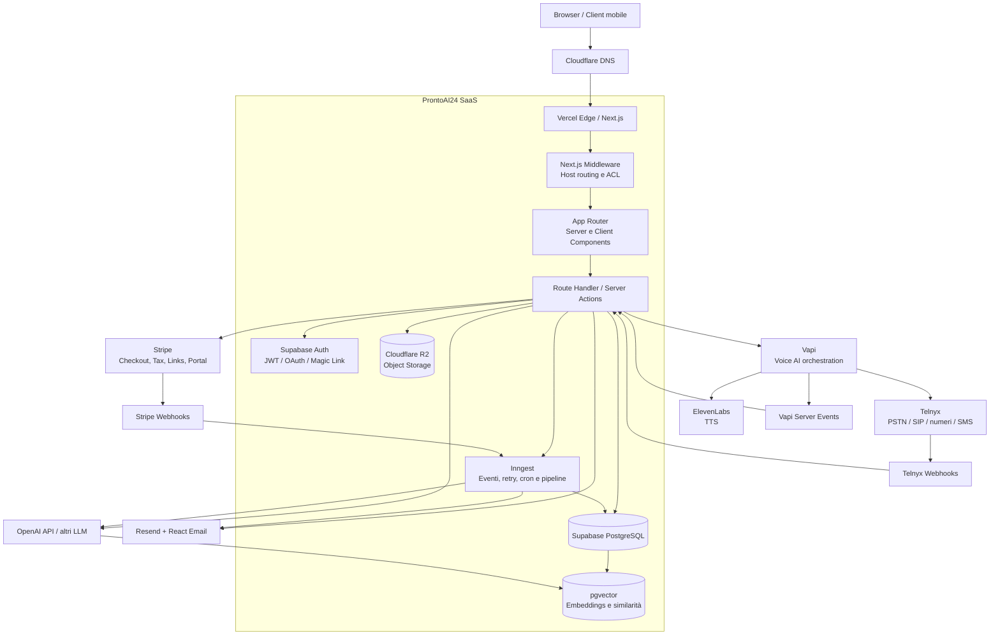

# Architettura tecnica di ProntoAI24

## 1. Panoramica generale

ProntoAI24 è una piattaforma SaaS multi-tenant per la gestione di assistenti vocali, chatbot, automazioni e servizi AI destinati a clienti aziendali. L’architettura adotta un modello full-stack moderno basato su Next.js, Supabase e servizi serverless. L’elaborazione asincrona è affidata a Inngest, mentre il sottosistema vocale combina Vapi, Telnyx ed ElevenLabs.

Il sistema è progettato secondo un modello **event-driven**. Le richieste sincrone gestite da Next.js eseguono autenticazione, validazione e operazioni brevi. Le attività lunghe o ripetibili, come elaborazione di webhook, ingestione documentale, generazione di embeddings, invio di notifiche e sincronizzazioni con provider esterni, devono essere demandate a funzioni Inngest.

Il dominio è isolato per tenant. Ogni cliente possiede dati applicativi, numerazioni, chiamate, documenti, configurazioni e messaggi separati. Le policy Row Level Security (RLS) di PostgreSQL costituiscono il controllo principale a livello dati; i controlli di ruolo nelle route Next.js costituiscono un secondo livello applicativo.

> **Nota sullo stato architetturale:** il repository contiene già il nucleo Next.js, Supabase Auth/PostgreSQL, onboarding tenant, provisioning Telnyx/Vapi, webhook, listino dinamico, storage Supabase per la Knowledge Base e integrazioni Stripe/Resend/Inngest. Cloudflare R2, pgvector e alcune pipeline AI asincrone sono componenti architetturali previste dallo stack e devono essere abilitate e verificate per ogni ambiente prima dell’uso in produzione.

## 2. Architettura di sistema



## 3. Frontend e UI layer

### 3.1 Next.js App Router

Il frontend utilizza Next.js con App Router e TypeScript. Le pagine server-side sono il punto preferenziale per il caricamento di dati autenticati, perché possono leggere la sessione Supabase sul server senza esporre credenziali privilegiate al browser.

I Client Components sono necessari per interazioni locali come form, slider, selezione piani, modali, tab, upload e aggiornamenti in tempo reale. Devono essere limitati alle porzioni interattive della pagina per ridurre il JavaScript inviato al client.

Il middleware gestisce il routing basato sull’host e sui sottodomini applicativi:

- `prontoai24.it`: sito pubblico;
- `admin.prontoai24.it`: area amministrativa;
- `client.prontoai24.it`: area cliente.

Le route riservate devono verificare sia l’autenticazione sia il ruolo applicativo. Il middleware non deve essere considerato l’unico confine di sicurezza: ogni route server-side deve ripetere i controlli necessari e utilizzare RLS o il client Admin solo quando l’operazione è esplicitamente autorizzata.

### 3.2 Tailwind CSS e design system

Tailwind CSS fornisce la composizione visuale delle pagine. Il design system ProntoAI24 utilizza card arrotondate, palette blu scuro e blu operativo, superfici chiare, accenti arancioni o lime e layout responsive.

I componenti interattivi devono rispettare i seguenti requisiti:

- stato `loading` durante le operazioni remote;
- messaggi di errore leggibili e non soltanto errori in console;
- stato di successo dopo il salvataggio;
- supporto tastiera e focus visibile;
- layout mobile senza sovrapposizioni;
- blocco delle azioni duplicate durante un submit;
- feedback chiaro per operazioni asincrone come compliance, provisioning e importazione documenti.

### 3.3 Caching e revalidation

Le pagine pubbliche possono usare caching e revalidation quando il contenuto non è personalizzato. Le dashboard, le pagine autentic ate e le API operative devono usare rendering dinamico o `cache: no-store` per evitare di mostrare dati tenant obsoleti.

Il listino dinamico viene ricaricato dalla schermata di creazione cliente quando la pagina torna visibile, riceve un evento `BroadcastChannel`, riceve un evento `storage` o esegue il refresh periodico previsto dal componente.

## 4. Backend e data layer

### 4.1 Next.js Route Handlers

Le route in `app/api` sono il confine server-side per:

- autenticazione e autorizzazione;
- validazione degli input;
- accesso a Supabase;
- chiamate a provider esterni;
- ricezione dei webhook;
- emissione di eventi Inngest;
- normalizzazione degli errori verso il frontend.

Le chiavi private di Stripe, Telnyx, Vapi, Resend, OpenAI e R2 non devono mai essere referenziate in Client Components o incluse in variabili `NEXT_PUBLIC_*`.

### 4.2 Supabase PostgreSQL

Supabase fornisce PostgreSQL, migrazioni SQL, Auth, Storage e accesso API. Le tabelle principali del dominio comprendono:

| Area | Tabelle principali | Funzione |
|---|---|---|
| Identità | `profiles` | Ruolo, profilo, stato primo accesso e relazione con Auth. |
| Tenant | `clients` | Anagrafica e amministratore responsabile del cliente. |
| Billing | `subscriptions`, `invoices`, `pricing_catalog` | Piano, abbonamento, fatture e listino dinamico. |
| Telefonia | `phone_numbers`, `call_logs`, `sms_messages` | Numeri, chiamate, messaggi e mapping Vapi/Telnyx. |
| Compliance | `telnyx_requirement_group_id`, `requirement_group_id` | Collegamento tra tenant, requisiti e numerazioni. |
| Knowledge | `knowledge_documents` | Metadati dei file RAG e percorso nello storage. |
| Attività | `business_settings`, `business_departments`, `business_faqs` | Configurazione azienda, reparti e FAQ. |
| Canali | `tenant_channel_settings`, `whatsapp_messages` | Configurazione Vapi, Meta, WhatsApp e chatbot. |
| Operatività | `tickets`, `audit_logs` | Supporto e tracciamento delle operazioni. |

Le migrazioni devono essere applicate in ordine. Ogni migration deve essere idempotente quando possibile, utilizzando `create table if not exists`, `add column if not exists` e indici con nomi stabili.

### 4.3 pgvector e RAG

Supabase PostgreSQL può utilizzare l’estensione `pgvector` per memorizzare embeddings associati a documenti, chunk e FAQ del tenant. Una struttura RAG tipica è composta da:

- documento originale e metadati in `knowledge_documents`;
- chunk testuali in una tabella documentale dedicata;
- embedding vettoriale per ogni chunk;
- identificativo `client_id` su ogni record;
- eventuale stato di ingestione e modello usato.

La ricerca semantica deve filtrare sempre per `client_id` prima o durante il calcolo della similarità. Le metriche più comuni sono:

- **cosine distance**, utile quando conta l’orientamento del vettore;
- **inner product**, utile con embeddings normalizzati;
- **Euclidean distance**, disponibile ma normalmente meno usata per embeddings testuali normalizzati.

La pipeline RAG consigliata è:

1. upload del file e creazione del record `knowledge_documents`;
2. estrazione del testo;
3. suddivisione in chunk con sovrapposizione controllata;
4. generazione degli embeddings tramite OpenAI o provider compatibile;
5. salvataggio dei vettori con `client_id`;
6. ricerca dei chunk rilevanti filtrata per tenant;
7. generazione della risposta tramite LLM;
8. audit dell’operazione e aggiornamento dello stato del documento.

## 5. Multi-tenancy e Row Level Security

L’isolamento multi-tenant si basa su una gerarchia applicativa:

```text
super_admin → admin → client/tenant
```

Le tabelle operative devono contenere `client_id`, direttamente o tramite una relazione verificabile. Le policy RLS devono limitare ogni `select`, `insert`, `update` e `delete` al tenant corretto.

Una policy tipica per un cliente è concettualmente equivalente a:

```sql
using (
  current_user_role() = 'client'
  and client_id in (
    select id from clients where profile_id = auth.uid()
  )
)
```

Gli amministratori devono essere limitati ai clienti assegnati tramite `managed_by_admin`, mentre i super admin possono operare sull’intero ambiente. Il client Supabase Admin con service role bypassa RLS e deve essere utilizzato esclusivamente in route server-side autorizzate, senza mai inviare la chiave al browser.

Le operazioni con provider esterni devono verificare l’appartenenza dell’oggetto al tenant prima di inviare richieste o salvare risultati. I webhook privi di `client_id` devono risolvere il tenant attraverso identificativi provider, come `telnyx_order_id`, `vapi_phone_id`, `vapi_assistant_id` o numero telefonico, e devono ignorare in modo auditabile gli eventi non risolvibili.

## 6. Autenticazione e autorizzazione

Supabase Auth gestisce identità e sessioni tramite JWT e cookie server-side. Il sistema può supportare:

- email e password;
- OAuth;
- magic link;
- reset password;
- cambio password obbligatorio al primo accesso.

Il flag `profiles.must_change_password` impedisce l’accesso normale alla dashboard finché l’utente non aggiorna la password temporanea. Il completamento deve aggiornare Auth e profilo tramite una route server-side con upsert amministrativo, quindi invalidare o aggiornare la sessione secondo il flusso applicativo.

Le route riservate devono restituire `401` quando manca la sessione e `403` quando l’utente autenticato non dispone del ruolo necessario. Gli errori di autorizzazione non devono rivelare dati appartenenti ad altri tenant.

## 7. Object Storage con Cloudflare R2

Cloudflare R2 è lo storage oggetti previsto per file pesanti, registrazioni e asset che non devono essere serviti direttamente da PostgreSQL. R2 è compatibile con l’API S3 e può essere utilizzato tramite SDK server-side.

Il percorso degli oggetti deve includere il tenant:

```text
{clientId}/{category}/{uuid}-{safeFileName}
```

I file non devono essere resi pubblici per default. Il backend deve generare presigned URL con durata limitata per upload e download, verificando prima che l’utente possa accedere all’oggetto. Una CDN Cloudflare può distribuire gli asset pubblici non sensibili, mentre registrazioni, documenti fiscali e file RAG devono restare privati.

Il database conserva i metadati, non il contenuto binario principale. Un record di documento deve includere almeno nome originale, percorso, MIME type, dimensione, tenant, autore, stato di ingestione e timestamp.

## 8. Background jobs ed eventi con Inngest

Inngest gestisce attività asincrone, retry e cron job senza prolungare i tempi di risposta delle route Vercel. Gli eventi devono avere payload minimali, versionabili e privi di segreti.

Casi d’uso principali:

- elaborazione asincrona dei webhook Stripe;
- aggiornamento dello stato degli abbonamenti;
- invio email Resend;
- parsing e ingestione dei documenti RAG;
- generazione embeddings;
- sincronizzazione degli stati Telnyx e Vapi;
- notifiche post-provisioning;
- calcolo di consumo minuti e metriche MRR;
- retry di provider temporaneamente indisponibili;
- cron di riconciliazione per ordini, fatture e messaggi.

Ogni job deve essere idempotente. Gli eventi provider devono avere un identificativo univoco e la piattaforma deve registrare l’avvenuta elaborazione per evitare doppi aggiornamenti o doppi invii email/SMS.

## 9. Integrazioni third-party

| Servizio | Tipo di connessione | Scopo | Flusso dei dati |
|---|---|---|---|
| Vercel | Deploy GitHub, HTTP | Hosting Next.js e route serverless | Push GitHub → build → preview o produzione. |
| GitHub | Git, CI/CD | Versionamento e workflow di deployment | Branch `main` → Vercel; branch/PR → preview. |
| Supabase | SDK, REST, PostgreSQL, Webhook | DB, Auth, RLS, Storage e pgvector | Next.js legge/scrive dati autorizzati; Auth emette sessione; job aggiorna pipeline. |
| Cloudflare R2 | S3 API, presigned URL | File, asset, registrazioni e documenti pesanti | Next.js crea URL firmati; browser trasferisce file; DB conserva metadati. |
| Stripe | SDK/API REST, Webhook, Payment Links | Checkout, abbonamenti, Tax, fatture e portale | Checkout → Stripe; eventi → Next.js/Inngest → Supabase. |
| Resend | SDK/API REST | Email transazionali | Evento applicativo/Inngest → template React Email → Resend → destinatario. |
| Inngest | SDK, event API, cron | Job asincroni e retry | Next.js emette eventi; Inngest esegue funzioni; risultati persistiti su Supabase. |
| Telnyx | API REST, Webhook | Numeri, compliance, chiamate telecom e SMS | Admin → Telnyx; eventi Telnyx → webhook → DB/job; SMS → API Telnyx. |
| Vapi | API REST, Server Events | Orchestrazione assistenti vocali | Next.js crea assistente e binding numero; Vapi invia eventi chiamata. |
| ElevenLabs | API REST, integrazione Vapi | Sintesi vocale TTS | Vapi o backend invia testo/configurazione; provider restituisce audio o stream. |
| OpenAI / LLM | API REST, SDK | Testo, classificazione, embeddings e assistenza AI | Next.js/Inngest invia prompt o chunk; risultato salvato o usato nel workflow. |

## 10. Stripe, Tax e pagamenti

Il flusso di pagamento può usare Stripe Checkout, Payment Links o Customer Portal. Stripe Tax calcola e registra le imposte sulla base della configurazione fiscale, dell’indirizzo del cliente e del prodotto/prezzo configurato.

Il flusso sincrono non deve considerare completato un abbonamento soltanto perché l’utente è tornato dalla pagina Checkout. La fonte autorevole è il webhook Stripe validato tramite `STRIPE_WEBHOOK_SECRET`. Gli eventi rilevanti includono creazione e aggiornamento del checkout, pagamento riuscito, pagamento fallito, aggiornamento o cancellazione dell’abbonamento e aggiornamento delle fatture.

La route webhook deve:

1. leggere il body raw;
2. verificare la firma Stripe;
3. deduplicare l’evento;
4. salvare l’evento o un audit log;
5. emettere un evento Inngest;
6. aggiornare `subscriptions` e `invoices` in modo idempotente.

## 11. Resend e React Email

Resend invia inviti, credenziali temporanee, notifiche di provisioning, ricevute e messaggi operativi. I template devono essere costruiti con React Email per mantenere una struttura coerente tra client email.

L’invio deve avvenire dopo la validazione dell’operazione applicativa. Per attività non urgenti è preferibile emettere un evento Inngest, in modo da applicare retry e non bloccare la risposta HTTP.

Le credenziali temporanee non devono essere registrate in `audit_logs`, nei log applicativi o nei payload Inngest. Il mittente deve appartenere a un dominio verificato su Resend.

## 12. Vapi, Telnyx ed ElevenLabs

### 12.1 Provisioning

Il provisioning vocale segue questo flusso:

1. l’admin crea il tenant;
2. il sistema raccoglie dati fiscali e documenti;
3. viene creato il Requirement Group Telnyx;
4. i documenti vengono caricati e associati ai requisiti;
5. viene inviato l’ordine del numero italiano con `requirement_group_id`;
6. il numero e il messaging profile vengono salvati in `phone_numbers`;
7. Vapi crea l’assistente con prompt, modello e voce;
8. il numero Telnyx viene importato in Vapi e associato all’assistente;
9. i webhook aggiornano stato compliance, numero, chiamate e SMS.

L’ordine Telnyx e la verifica regolatoria sono asincroni. La UI deve mostrare stati intermedi come `pending`, `under_review`, `approved`, `rejected` e `active` senza assumere che un ordine HTTP completato equivalga a una numerazione già operativa.

### 12.2 Chiamate

Vapi orchestra la conversazione e invia eventi server-side, inclusi eventi di fine chiamata con durata, trascrizione, registrazione e motivo di chiusura. Il backend deve risolvere il tenant attraverso metadata, assistant ID, Vapi phone ID o numero telefonico.

I dati salvati in `call_logs` devono contenere `client_id`, direzione, numeri, durata, URL registrazione, trascrizione, outcome e timestamp. Le registrazioni devono essere protette e, quando richiesto, trasferite in R2 con URL firmato.

### 12.3 SMS

Gli SMS transazionali vengono inviati tramite Telnyx usando il numero mittente e il messaging profile del tenant. Il backend registra prima il messaggio come `queued`, esegue la richiesta provider e aggiorna lo stato con `provider_message_id`. Gli eventi di delivery aggiornano `sent`, `delivered` o `failed` senza creare duplicati.

ElevenLabs fornisce la voce TTS direttamente o attraverso Vapi. La configurazione della voce deve essere validata e associata al tenant, evitando che un utente possa utilizzare o modificare la configurazione di un altro cliente.

## 13. OpenAI e pipeline AI

OpenAI o provider LLM compatibili possono essere utilizzati per:

- generazione della descrizione aziendale;
- classificazione di ticket e lead;
- estrazione di dati da documenti;
- risposta del chatbot;
- generazione di prompt assistente;
- embeddings per RAG;
- riassunti di chiamate e trascrizioni.

I prompt devono essere versionati quando influenzano il comportamento operativo. Le chiamate costose o lente devono essere eseguite tramite Inngest. I risultati devono includere modello, versione prompt, tenant, stato e timestamp per permettere audit e riproducibilità.

## 14. Sicurezza e variabili d’ambiente

Le variabili pubbliche devono contenere soltanto valori destinati al browser, come URL pubblici e chiavi anonime con permessi limitati. Le chiavi server-side devono restare in Vercel Environment Variables e non devono essere committate.

Esempio di classificazione:

| Variabile | Esposizione | Uso |
|---|---|---|
| `NEXT_PUBLIC_SUPABASE_URL` | Pubblica | Endpoint pubblico Supabase. |
| `NEXT_PUBLIC_SUPABASE_ANON_KEY` | Pubblica | Client Supabase con RLS. |
| `SUPABASE_SERVICE_ROLE_KEY` | Solo server | Operazioni amministrative autorizzate. |
| `STRIPE_SECRET_KEY` | Solo server | API Stripe. |
| `STRIPE_WEBHOOK_SECRET` | Solo server | Verifica webhook Stripe. |
| `TELNYX_API_KEY` | Solo server | API numeri, compliance e SMS. |
| `TELNYX_WEBHOOK_PUBLIC_KEY` | Server | Verifica webhook Telnyx. |
| `VAPI_PRIVATE_KEY` | Solo server | Creazione assistenti e binding. |
| `RESEND_API_KEY` | Solo server | Invio email. |
| `INNGEST_SIGNING_KEY` | Solo server | Verifica richieste Inngest. |
| `R2_SECRET_ACCESS_KEY` | Solo server | Accesso Cloudflare R2. |
| `OPENAI_API_KEY` | Solo server | LLM ed embeddings. |

I webhook devono verificare le firme usando il body raw e gli header previsti dal provider. È necessario validare:

- Stripe tramite `STRIPE_WEBHOOK_SECRET`;
- Inngest tramite signing key;
- Telnyx tramite chiave pubblica e header di firma;
- Vapi tramite il meccanismo di autenticazione configurato sul server URL;
- Resend tramite il meccanismo di verifica previsto per gli eventi configurati.

I payload webhook devono essere deduplicati, limitati nella dimensione e registrati senza dati segreti. Gli audit log devono contenere identificativi tecnici e stato dell’operazione, non password, token o contenuti sensibili non necessari.

## 15. CI/CD e deployment

Il workflow consigliato è:

```text
GitHub branch / PR
        ↓
Controlli TypeScript, lint e test
        ↓
Vercel Preview Deployment
        ↓
Verifica funzionale e review
        ↓
Merge su main
        ↓
Vercel Production Deployment
```

Le migration Supabase devono essere versionate nel repository e applicate con Supabase CLI o pipeline controllata. Ogni migration deve essere verificata nell’ambiente di staging prima della produzione.

Le variabili devono essere separate per ambiente:

- Development;
- Preview/Staging;
- Production.

Le preview deployment non devono puntare a dati di produzione senza un’esplicita decisione operativa. Le integrazioni webhook devono avere URL separati o routing controllato per ambiente.

## 16. Osservabilità e gestione errori

Ogni operazione esterna importante deve registrare:

- tenant coinvolto;
- provider;
- tipo di operazione;
- identificativo provider;
- esito;
- durata;
- eventuale codice errore;
- correlation ID.

Le risposte API devono utilizzare codici HTTP coerenti:

- `400` per input non valido;
- `401` per sessione mancante;
- `403` per ruolo insufficiente;
- `404` per risorsa non trovata nel perimetro autorizzato;
- `409` per conflitto o duplicato;
- `502` per errore provider;
- `503` per configurazione mancante o servizio indisponibile.

I retry devono essere applicati soltanto a errori transitori. Le operazioni non idempotenti, come acquisto numeri o invio SMS, devono avere chiavi di idempotenza o controlli applicativi prima del retry.

## 17. Checklist operativa per la produzione

- [ ] Migration Supabase applicate nell’ordine corretto.
- [ ] RLS verificato per ogni nuova tabella.
- [ ] `pgvector` installato e indice vettoriale dimensionato correttamente.
- [ ] Bucket R2 creati con policy private.
- [ ] Presigned URL configurati con durata limitata.
- [ ] Variabili server-side configurate in Vercel.
- [ ] Domain e webhook provider verificati.
- [ ] Firme Stripe, Telnyx, Vapi e Inngest testate.
- [ ] Retry e deduplicazione Inngest attivi.
- [ ] Backup e retention definiti per database e file.
- [ ] Cleanup automatico dei tenant e file di test verificato.
- [ ] Test multi-tenant eseguiti con utenti appartenenti a tenant differenti.
- [ ] Build di produzione e smoke test applicativi completati.

## Riferimenti

[1]: https://nextjs.org/docs/app "Next.js App Router Documentation"

[2]: https://supabase.com/docs/guides/database/postgres/row-level-security "Supabase Row Level Security"

[3]: https://supabase.com/docs/guides/ai/vector-columns "Supabase Vector Columns and pgvector"

[4]: https://developers.cloudflare.com/r2/ "Cloudflare R2 Documentation"

[5]: https://docs.stripe.com/webhooks "Stripe Webhooks Documentation"

[6]: https://resend.com/docs "Resend Documentation"

[7]: https://www.inngest.com/docs "Inngest Documentation"

[8]: https://docs.vapi.ai/server-url/events "Vapi Server Events"

[9]: https://developers.telnyx.com/docs "Telnyx API Documentation"

[10]: https://elevenlabs.io/docs/api-reference "ElevenLabs API Documentation"

[11]: https://platform.openai.com/docs "OpenAI API Documentation"
