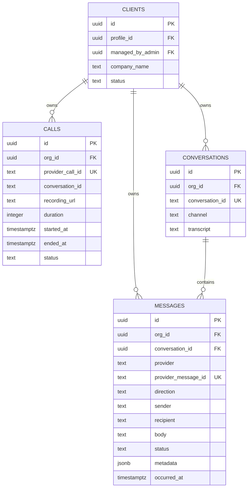

# Architettura omnicanale e osservabilità

## Modello dati definitivo

`clients.id` è il tenant identifier applicativo e viene propagato come `org_id` nei dati operativi. La denominazione `org_id` è mantenuta per compatibilità con gli eventi provider e per rendere esplicito il confine di isolamento multi-tenant.



### Vincoli e isolamento

| Entità | Tenant key | Relazione | Canali/valori |
|---|---|---|---|
| `calls` | `org_id` | `org_id -> clients.id` | voice |
| `conversations` | `org_id` | `org_id -> clients.id` | voice, whatsapp, webchat |
| `messages` | `org_id` | `org_id -> clients.id`; `conversation_id -> conversations.id` | whatsapp, webchat |

Le policy RLS permettono l’accesso completo ai super-admin, limitano gli admin ai client da loro gestiti e permettono ai client di leggere soltanto i dati associati al proprio profilo. Il webhook usa il client Supabase Admin esclusivamente server-side per ricevere eventi provider; il frontend non riceve mai la service role key.

## Pipeline webhook sicura

1. Il provider invia il payload all’endpoint `/api/webhooks/ai/[provider]`.
2. Il server applica il rate limit per provider e IP. Il fallback corrente è in-memory per singola istanza; per più istanze Vercel va sostituito con Upstash Redis o un altro contatore distribuito.
3. Il body raw viene conservato prima del parsing JSON.
4. WhatsApp viene autenticato con `X-Hub-Signature-256` e `WHATSAPP_APP_SECRET`.
5. Vapi viene autenticato con `x-vapi-signature`/`x-signature` e `VAPI_WEBHOOK_SIGNING_SECRET`.
6. Web Chat usa `NEXT_PUBLIC_WEBCHAT_PUBLIC_KEY`; il browser non deve conoscere un secret server-side.
7. Il tenant viene risolto da `org_id` o dal mapping telefonico.
8. Il sistema esegue upsert della conversazione e inserisce il messaggio con idempotenza provider/message ID.
9. Sentry riceve l’errore o l’evento con il tag `org_id`.
10. Langfuse riceve una trace/evento con canale, `org_id` e metadati non sensibili.

## Rate limiting

Variabili:

```text
WEBHOOK_RATE_LIMIT_MAX=120
WEBHOOK_RATE_LIMIT_WINDOW_MS=60000
```

Il limite è per combinazione `provider:IP`. Una risposta `429` include `Retry-After`. Il limite in-memory protegge una singola istanza ma non garantisce coordinamento globale tra molte istanze serverless. In produzione è consigliato configurare `@upstash/ratelimit` con:

```text
UPSTASH_REDIS_REST_URL=
UPSTASH_REDIS_REST_TOKEN=
```

## Fallback e produzione

`WEBHOOK_ALLOW_SHARED_SECRET_FALLBACK=true` è ammesso solo per sviluppo o test controllati. In produzione deve restare `false` e devono essere configurati i secret HMAC provider-specifici.

Per l’osservabilità:

```text
NEXT_PUBLIC_SENTRY_DSN=
SENTRY_AUTH_TOKEN=
LANGFUSE_PUBLIC_KEY=
LANGFUSE_SECRET_KEY=
LANGFUSE_HOST=https://cloud.langfuse.com
OBSERVABILITY_DEFAULT_ORG_ID=default
```

Se Sentry o Langfuse non sono configurati, il flusso applicativo non viene bloccato: gli helper degradano in modo controllato. Questa condizione è osservabile nei log di deploy e deve essere verificata prima del go-live.
